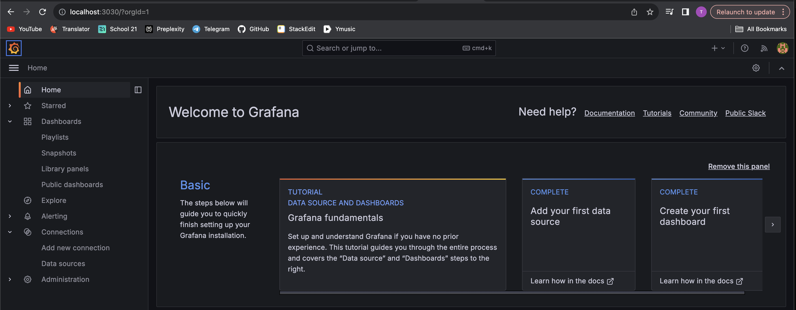

#### 1) Install and configure Prometheus and Grafana in virtual machine.
#### 2) Access the Prometheus and Grafana web interfaces from a local machine.

#### 3)Add to the Grafana dashboard a display of CPU, available RAM, free space and the number of I/O operations on the hard disk.

#### 4) Run your bash script from Part 2.

#### 5) Check the hard disk load (disk space and read/write operations).

#### 6) Install the stress utility and run the following command stress -c 2 -i 1 -m 1 --vm-bytes 32M -t 10s.

#### 7) Check the hard disk, RAM and CPU load.

