#### 1) Download the ready-made dashboard Node Exporter Quickstart and Dashboard from Grafana Labs official website.
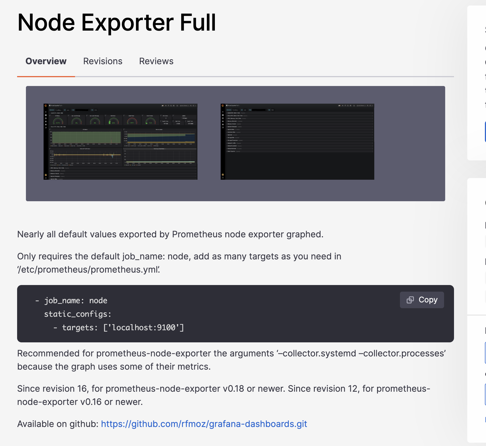
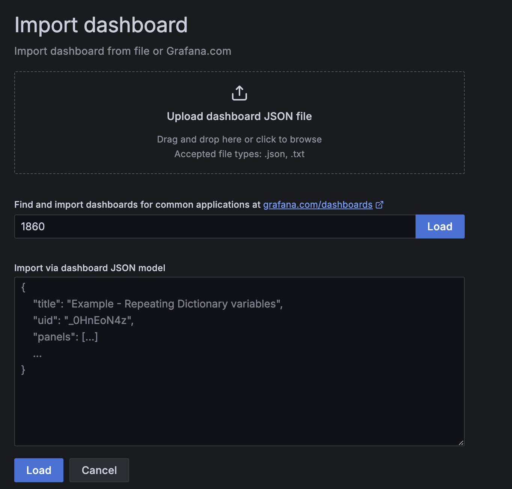
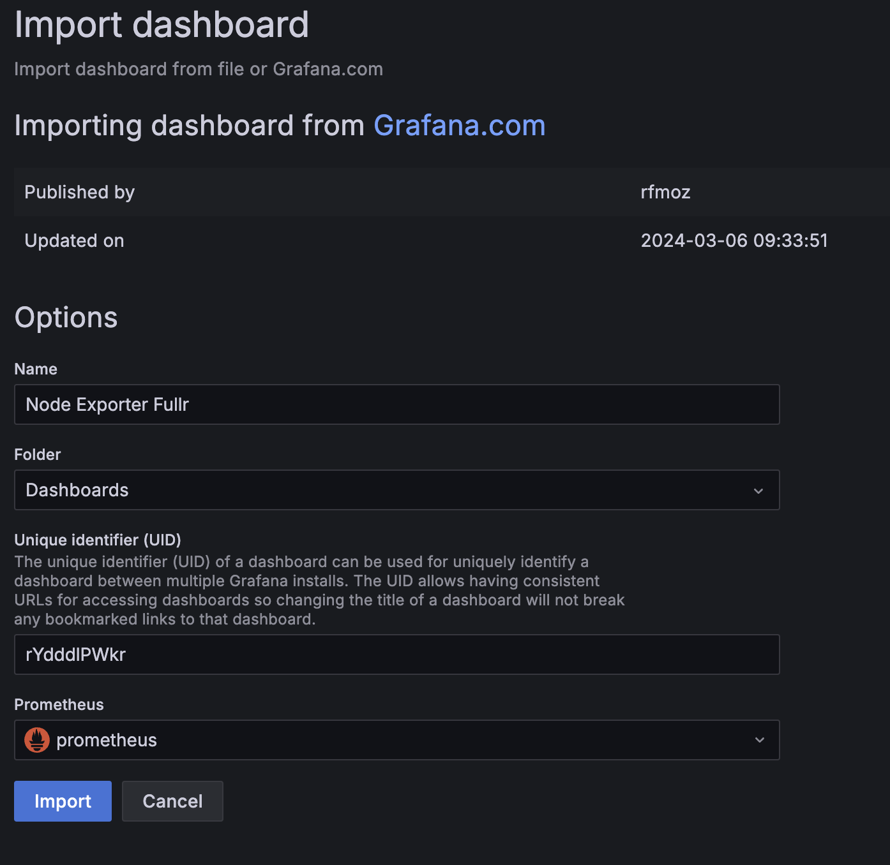
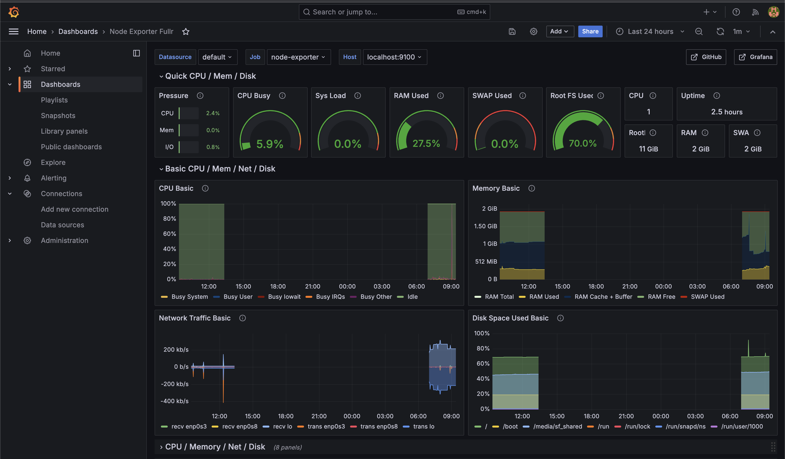

#### 2) Run the same tests as in Part 7.
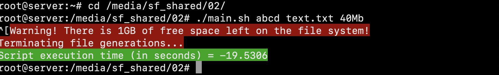
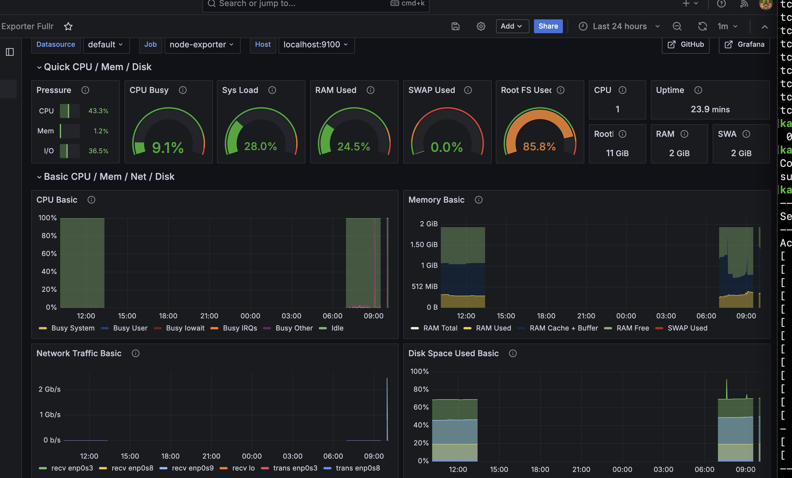
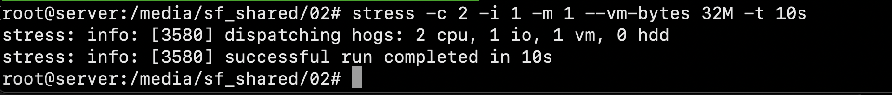
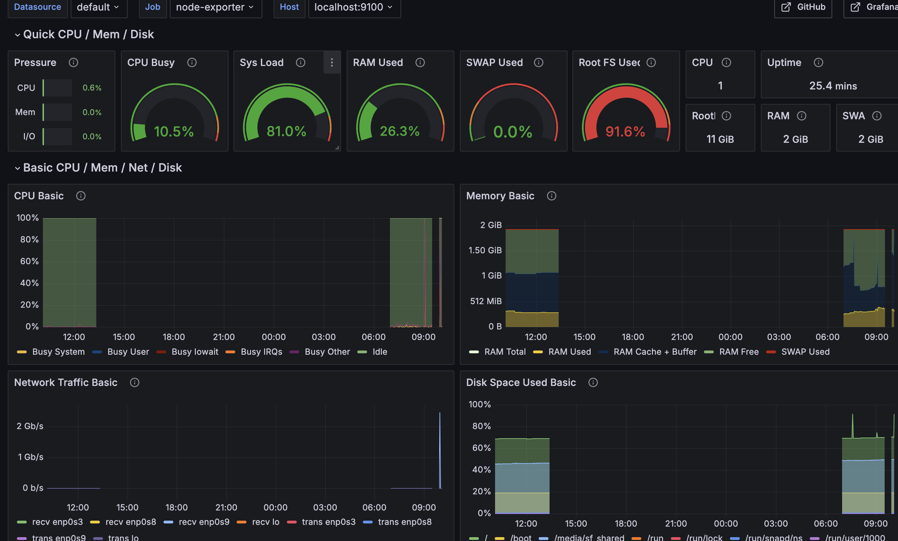

#### 3) Start another virtual machine within the same network as the current one.
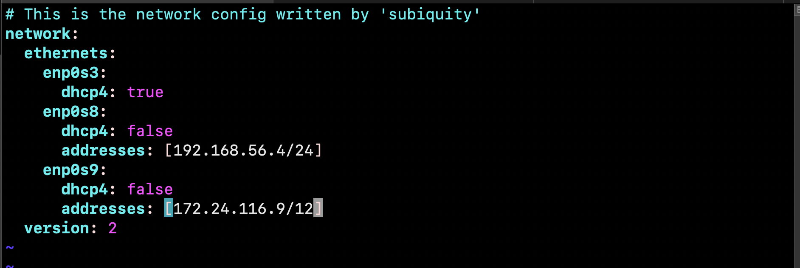
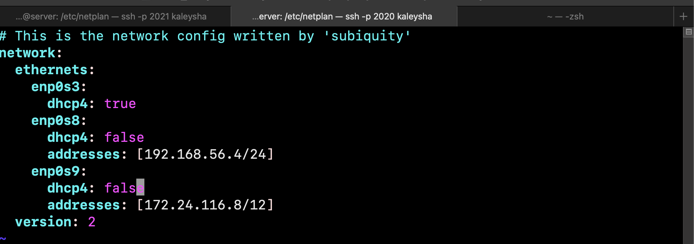
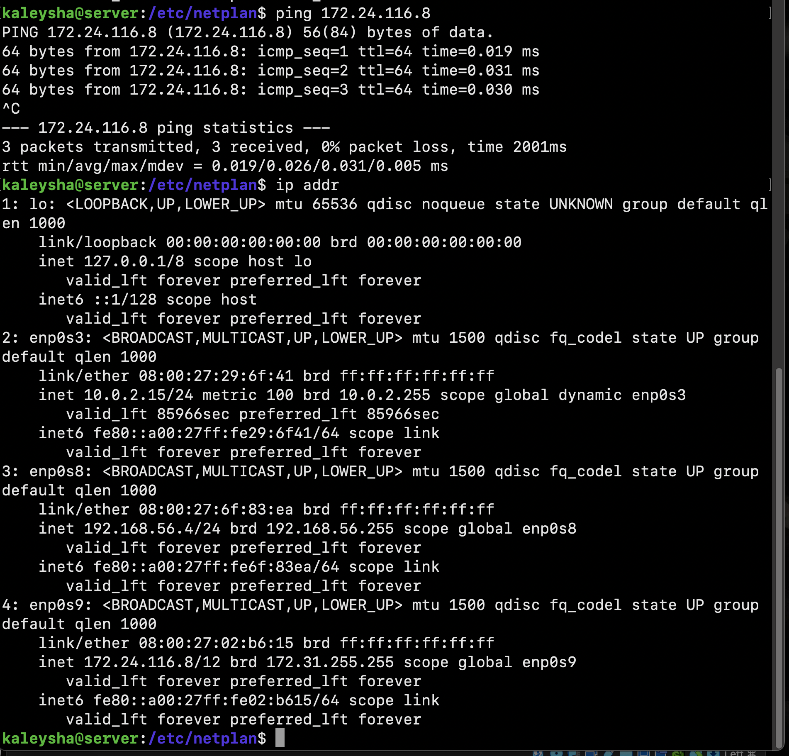

#### 4) Run a network load test using iperf3.
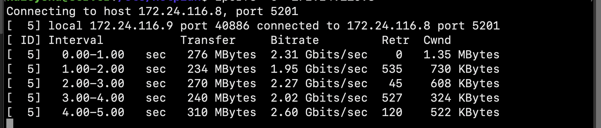
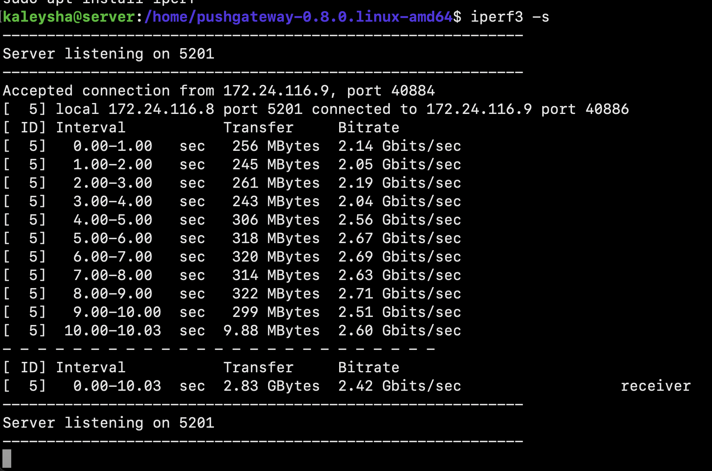
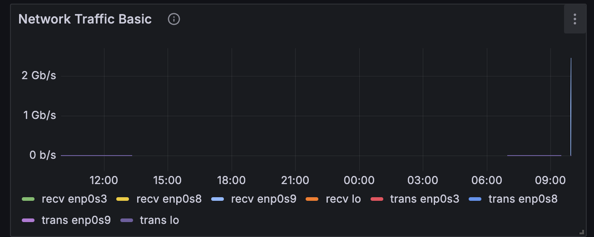
